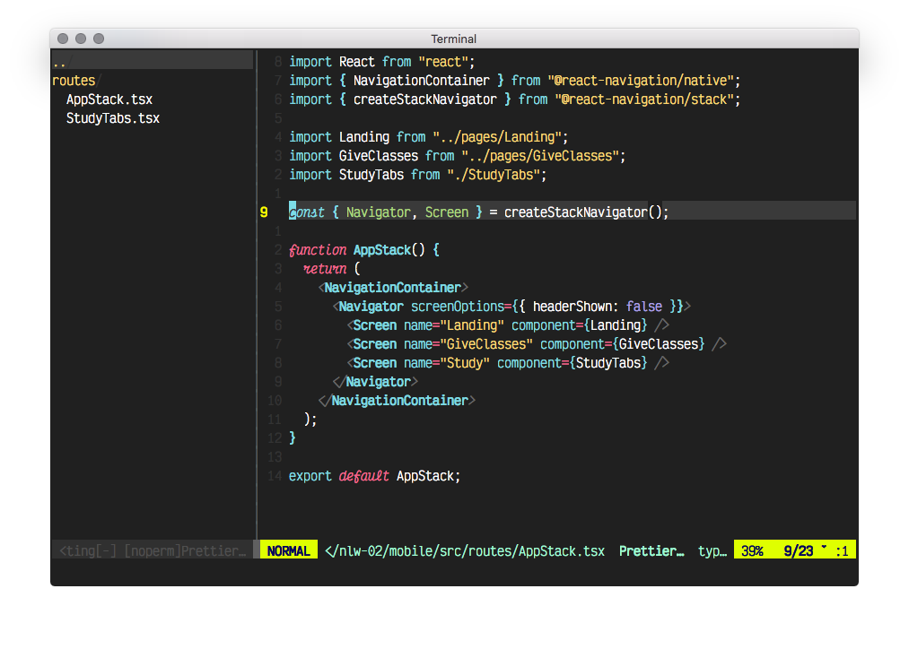

# [Elf] Monokai Pro

** [Elf] Monokai Pro Screenshot **

---

This is a theme for VIM adapted from the famous Monokai Pro theme, with a little twists here and there.
It has support for italic fonts, too. The font used in the screenshots is Victor Mono.

To use it, follow these steps:

1. Download or clone this repo
2. Copy the `colors/elf_monokai_pro.vim` file to your NVIM colors directory, usually `~/.config/nvim/colors/`
3. ???
4. Profit!
