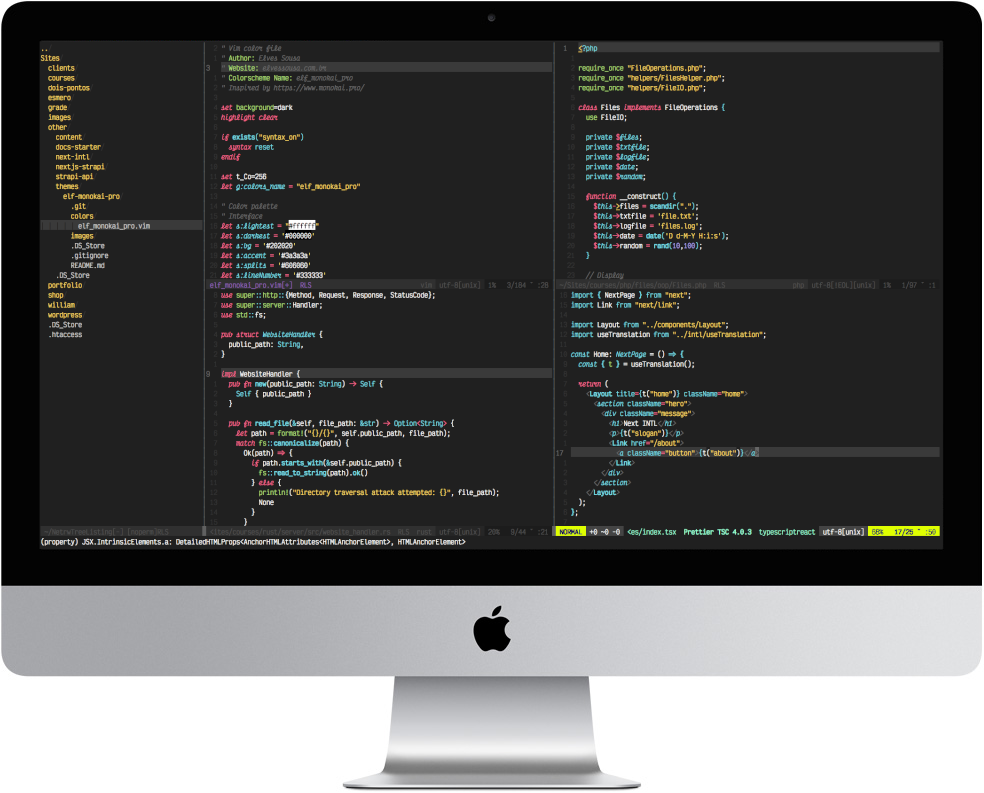

# [Elf] Monokai Pro



## About this theme

This is a theme for **Vim** and **Neovim** adapted from the famous [Monokai Pro theme](https://monokai.pro), with a little twists here and there. It has support for italic fonts, too. The font used in the screenshots is Victor Mono. At the moment, I only tested it in Neovim, but I think it should work with Vim as well.

## Installation

To use it, follow these steps:

1. Copy the `colors/elf_monokai_pro.vim` file to your NVIM colors directory, usually `~/.config/nvim/colors/`
2. Set the color scheme: `:colorscheme elf_monokai_pro`.
3. ???
4. Profit!

## Setting it as your default theme

For the best experience, make sure your terminal supports true colors.
If you want to make it your default, just add this line to your `init.vim`:

```vim
colorscheme elf_monokai_pro
```

Take cake!
