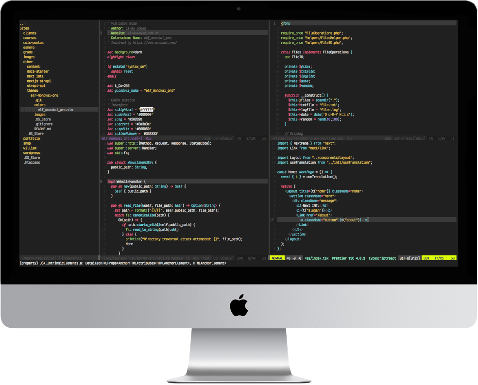

# [Elf] Monokai Pro



---

This is a theme for VIM adapted from the famous Monokai Pro theme, with a little twists here and there.
It has support for italic fonts, too. The font used in the screenshots is Victor Mono.
In the moment, I only tested it in NVim, but I think it will work with Vim as well.

To use it, follow these steps:

1. Copy the `colors/elf_monokai_pro.vim` file to your NVIM colors directory, usually `~/.config/nvim/colors/`
2. Set the color scheme: `:colorscheme elf_monokai_pro`.
3. ???
4. Profit!

Make sure your terminal supports true colors, for the best experience.
If you want to make it your default, just add this line to your `init.vim`:

```vim
colorscheme elf_monokai_pro
```
